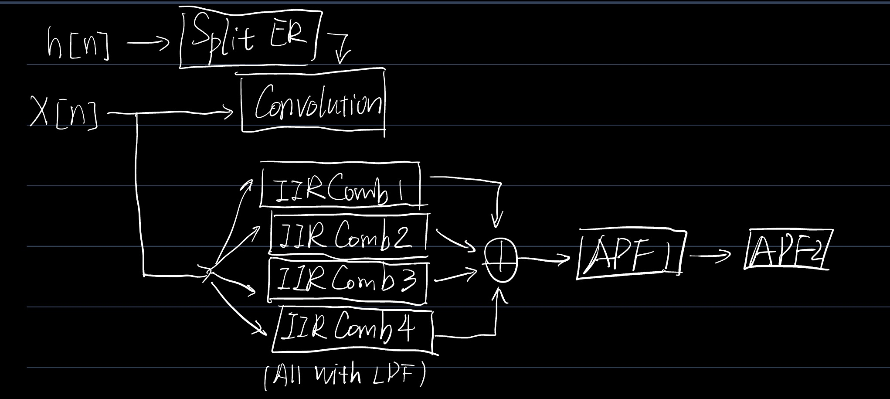
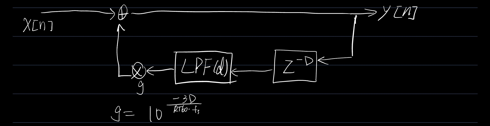
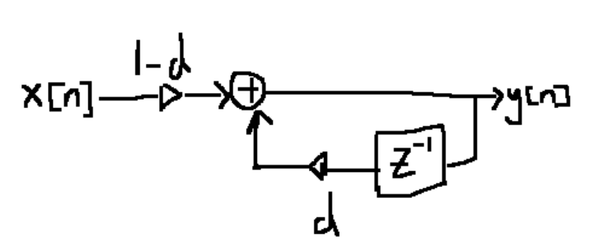
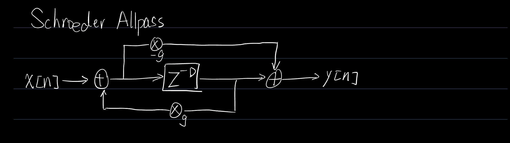

# Split RIR Reverb

A hybrid reverb system combining impulse response convolution (early reflections) and algorithmic reverberation (Schroeder-style tail), designed to balance audio quality and computational efficiency for real-time applications such as games or interactive audio systems.

## Overview

This project explores different approaches to reverberation：

- Full FFT convolution reverb (baseline)  
- Split IR FFT convolution (early reflections only)
- Algorithmic reverb tail (comb + allpass)
- Hybrid reverb (early + tail)

The goal is to:  
Achieve comparable spatial perception to full convolution while significantly reducing computation cost.

## Architecture (hybrid reverb)

### Overall

### IIR Comb with LPF

### Schroeder APF

### Output
**Reverb Tail**:    
y_tail = 0.2 * IIR_Comb_out + 0.3 * APF1_out + 0.5 * APF2_out

**Total Output**:   
y = early_gain * signal_early_p + tail_gain * signal_tail_p   
(early_gain and tail_gain is adjustable, _p stands for padded version.)

## Early Reflection
- Extracted the first ~120 ms of the impulse response
- Performed convolution using FFT-based method and block processing
- Calculate time for processing each block

## Late Reverb Tail
Implemented a classic **Schroeder reverberator**:  
### Structure
- 4 parallel comb filters  (with LPF inside)
- 2 serial allpass filters  

**How late IR affects reverb tail?**
1. Compute **Energy Decay Curve (EDC)** and estimate remaining **RT60** (estimated, not real RT60) by late impulse response using schroeder's method. **Estimated RT60** is used for compute **feedback gain** for IIR Comb filter to control tail decay.
2. Filters late IR by LPF with cutoff freq 1000Hz and HPF with cutoff freq 2000Hz, to get low-pass late IR and high-pass late IR. And use them to compute **damping** coefficient for LPF.
3. Late IR mainly affects coefficients in Comb filter rather than Allpass filter, because allpass filters are used for diffusion, and I want it to be more adjustable so that I can adjust listening experience by myself.

### Tail Processing Strategy
- Implemented as sample-by-sample IIR network
- Wrapped into block-style interface for realism
- Calculate time for processing each block

## Mxing
- Early reflection and reverb tail are mixed together by early_gain and tail_gain.
- Before mixing, we need to pad them into same length.
- Normalization is applied.

## Results
### Measured Processing Time
Method	Time (s)：  
Hybrid (Early + Tail）：0.0017  
Full Convolution：0.0325  

 ~19x speed improvement
### Latency Constraint
block_size = 256  
fs = 44100  
latency ≈ 5.8 ms

✔ Hybrid processing fits within real-time constraints  
✔ Full convolution is significantly slower

### Listening Experience
Depends on the mix gain of early and tail, and the length of early IR. From my perspective, the hybird version "sig_hybird_reverb.wav" is close to fully-conv version "sig_full_conv.wav".

## Possible Improvements
- Can be implemented with partitioned convolution.
- Can have multi-channel version if needed.
- Can be more Frequency-dependent (apply on diff freq bands).
- GPU / SIMD optimization
- More accurate RT60 estimation.

## Reference
Schroeder, M. (1962). Natural sounding artificial reverberation. J. Audio Eng. Soc., 10.  
Schroeder, M. R. (1965). New Method of Measuring Reverberation Time. The Journal of the Acoustical Society of America, 37(6_Supplement), 1187–1188. https://doi.org/10.1121/1.1939454
