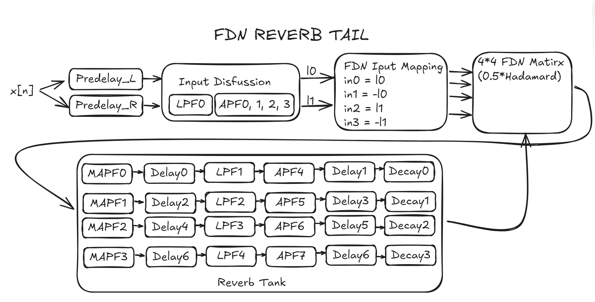

# Split RIR Reverb

This is a hybrid reverb project designed for real-time audio applications. It splits a **stereo Room Impulse Response (RIR)** into two parts: **early reflections and late reverberation**. The early part preserves the strengths of convolution reverb in **spatial detail and localization cues**, while the late part uses an algorithmic reverb network to approximate **the long decay tail**, reducing the **computational cost** of directly convolving with a long IR.

Traditional long-IR convolution is highly realistic acoustically, but when the IR becomes long, the real-time processing cost increases significantly. This project uses a split-RIR hybrid strategy:

1. Use automatic analysis methods to find the **timing of the direct sound and the early reflections** in the IR.
2. Keep the early IR, which includes the direct sound and early reflections, and process this part with **block-based RFFT convolution**.
3. Extract parameters from the IR, including **decay behavior, frequency tendency, and stereo width**.
4. Generate the late tail with a stereo **algorithmic reverb network** instead of continuing full convolution on the entire long IR.
5. Re-align, mix, and normalize the early convolution result and the synthetic late tail.

## Processing Flow of the Current Implementation

### 1. Input and Sample-Rate Unification

The current example in `Split_Full_RIR.ipynb` uses:

- Dry input: `a-minor-dance-piano~2.wav`
- Long-IR example: `base_44_hemiaux_center_sck_023.wav` and more.
- Short-IR example: `BRIR_R09_C1_E0_A0.wav` (the notebook keeps the switching code commented out) and more.

The whole system runs at `Fs = 44100` Hz. If the original signal has a different sample rate, the `resample()` function in `Early_IR_Conv.py` uses `scipy.signal.resample_poly` to resample it to the system sample rate.

### 2. Early Part: Automatic Estimation of Direct Sound and the Early/Late Split

The logic of the early path is mainly implemented in [Early_IR_Conv.py](Early_IR_Conv.py).

#### Direct Sound Detection `estimate_t0()`

Instead of simply looking for the maximum peak, this step first works in the energy domain:

- Normalize the IR.
- Compute short-window sliding RMS values.
- Treat the first small segment of samples as a noise segment.
- Build a threshold `T = mu + k * sigma` using the mean and standard deviation of the noise RMS.
- Use the first point above the threshold as the arrival time of the direct sound, `t0`.

The purpose is to avoid false detection caused by relying only on instantaneous peaks, and to make the detection closer to the moment when the **energy first clearly rises above the noise floor**.

#### Early Reflection End-Time Estimation `estimate_ER_time()`

Late reverberation is closer to G**aussian-distributed white noise**, while early reflections usually do not show this characteristic as strongly. Based on that idea, the method detects their boundary by computing the **kurtosis** of each short segment.

After detecting the direct sound, the code first removes the silence before it, then performs sliding-window kurtosis analysis on the remaining IR:

- Compute kurtosis frame by frame.
- Apply exponential moving averaging to the kurtosis curve to reduce fluctuation.
- Use two heuristic rules at the same time to find the end of the early reflections:
  - The point where the slope of the smoothed curve drops the fastest.
  - The first point where the curve approaches the tail-noise threshold.
- Take the earlier and more conservative result.
- Add an additional `20 ms` transition margin to obtain `t_split`.

#### Crossfaded Splitting `split()`

The IR is not split with a hard cut. Instead, it uses overlap plus linear crossfade:

- `time_direct` is used as the starting point of the early IR.
- `time_split` is used as the fade-out point of the early IR.
- `fade_time` is set to `0.003 s`, or `3 ms`, in the notebook by default.

### 3. Early-Part Convolution: Preserving Key Spatial Cues

The early convolution still uses an RFFT-based approach, but only on the truncated early IR.

Related implementation:

- `fast_conv()`: performs RFFT convolution between a single block and a mono IR.
- `running_convolver_stereo()`: convolves a mono input with the left and right early IRs separately, then accumulates the output using block processing.

### 4. Late Part: Extract Parameters and Generate the Tail with Stereo FDN

The core of the late path is implemented in [Late_reverb_tail.py](Late_reverb_tail.py).

#### 4.1 RT60 Estimation `compute_edc_rt60()`

The code first computes the **EDC** using **Schroeder backward integration**:

- Convert the IR into the energy domain `h^2`.
- Obtain the Energy Decay Curve by reverse cumulative summation.
- Convert it to dB and normalize it so that it starts at `0 dB`.
- Fit a straight line over the range from `-5 dB` to `-35 dB`.
- Estimate `RT60` from the fitted slope.

This `RT60` is better understood as an estimated control parameter for the decay speed of the algorithmic tail, rather than a highly reliable physical ground truth of room acoustics.

#### 4.2 Frequency-Dependent Damping `onepole_lowpass() / onepole_highpass() / calculate_d()`

To avoid making the late reverb decay uniformly across the entire frequency range, the code does two things:

- Split the late IR into a first-order low-passed version and a first-order high-passed version.
- Estimate the RT60 of the low-frequency and high-frequency parts separately.

Then `calculate_d()` computes a **damping** coefficient from the difference between the low- and high-frequency RT60 values:

- If the high frequencies decay faster, the damping becomes stronger.
- The coefficient is limited within a **predefined range**.

This parameter is then passed into the low-pass damping module `LPF_Damping` in the feedback path, so that the generated tail has a more reasonable frequency-dependent decay behavior.

#### 4.3 Stereo Width Estimation `stereo_width()`

The code estimates the stereo width of the original IR using the mid-side energy ratio, removing the impact of offsets of stereo imaging and uses it to determine the complexity of the late reverb network:

- When `width > 0.3`, extra APFs are enabled in the tank.
- When `width > 0.6`, extra delay lines are added.

#### 4.4 Stereo FDN Core `Stereo_FDN_Reverb`

The late tail is designed so that the temporal decay, frequency decay, and stereo width of the late IR are all mapped into the parameters of the algorithmic network.

Its structure can be summarized as:

1. Input diffusion
2. 4x4 Hadamard feedback matrix
3. Four main branches of modulated allpass + delay + damping
4. Extra APF / delay enabled according to width
5. Feedback decay gains calculated from the estimated RT60
`g = 10 ** ((-3.0 * n) / (esti_rt60 * fs))`
6. Left and right outputs formed by branch pairing based on sorted gains

### 5. Mixing and Final Output `mix()`

The final output is not obtained by direct summation. The code also includes several perceptually important steps:

- Remove the silence at the beginning of the tail with `trim_leading_silence_stereo()` to avoid an obvious echo impression.
- Pad the early and tail signals to the same length.
- Mix them to the target gain ratio of square-rooted energy ratio of direct + early IR and late IR each channel.
- Add the direct-sound arrival times `t0_L` and `t0_R` back as predelay for the left and right channels.
- Normalize the final output.

## Current Results

### Processing Time

Under the settings `Fs = 44100` and `block_size = 256`, the notebook records the following results for one of long example:

| Method | Average time per block |
| --- | ---: |
| Early convolution only | `0.000132 s` |
| Late tail synthesis | `0.004193 s` |
| Hybrid total (early + tail) | `0.004325 s` |
| Full convolution with full IR | `0.109090 s` |

From this:

- The theoretical block duration / latency is about `256 / 44100 = 0.005805 s`
- Hybrid processing time per block is about `0.004325 s`
- Full convolution processing time per block is about `0.109090 s`
- The **speed-up** is about `25.22x`(And `5xx` ~ `30xx` over all samples)

### Real-Time Interpretation

These results show that:

- The average processing time of the hybrid method is **already below the block duration**, so under this experiment setting it has the potential to satisfy real-time constraints.
- Full convolution is much slower than the block duration under the same setting, so using it directly for low-latency real-time processing would be difficult.

### Limitation of RT60 Estimation

The notebook also compares the estimated result from `compute_edc_rt60()` with `pyroomacoustics.experimental.measure_rt60()`. For the current long-IR example:

- `pyroomacoustics` measures the left and right RT60 as about `3.731 s` and `3.746 s`
- The average relative error is about `0.6455`

When the decay curve shows **multi-slope decay behavior**, a simple **linear fitting** method cannot represent the true late reverberation behavior very well. Therefore, the RT60 here is better treated as a practical parameter for controlling the decay of the algorithmic tail, rather than a strictly accurate room-acoustics measurement.

### Subjective Listening

Example files in audio file:

- `sig_hybird_reverb_long.wav`
- `sig_full_conv_long.wav`
- `sig_hybird_reverb_short.wav`
- `sig_full_conv_short.wav`

These can be directly compared in A/B listening. The hybrid result is not intended to reproduce full convolution sample by sample, but rather to achieve a similar subjective spatial impression with significantly lower computational cost.

## Dependencies

The notebook and scripts currently depend on:

- `numpy`
- `scipy`
- `soundfile`
- `matplotlib`
- `pyroomacoustics`
- `IPython`
- `jupyter`

## Possible Improvements

- Replace the current RFFT convolution with **partitioned convolution** as a stronger real-time convolution baseline.
- Improve **RT60 estimation** so that it better handles multi-slope decay.
- Extend late-parameter estimation to **more frequency bands** instead of only simple low/high-frequency differences.
- Support **multichannel or binaural / ambisonic** scenarios.
- Add **more parameter** mapping to the FDN reverb tank instead of relying mostly on manual tuning.
- Add more example samples, more objective metrics, and more systematic subjective listening experiments.

## References

- Schroeder, M. R. (1962). Natural sounding artificial reverberation. Journal of the Audio Engineering Society, 10.
- Schroeder, M. R. (1965). New Method of Measuring Reverberation Time. The Journal of the Acoustical Society of America, 37(6 Supplement), 1187-1188. https://doi.org/10.1121/1.1939454
- Dattorro, Jon; 1997; Effect Design, Part 1: Reverberator and Other Filters [PDF]; CCRMA, Stanford University, Stanford, CA; Paper ; Available from: https://aes.org/publications/elibrary-page/?id=10160
- Stewart, R., & Sandler, M. (2007). STATISTICAL MEASURES OF EARLY REFLECTIONS OF ROOM IMPULSE RESPONSES.

For more detailed information and literature review about the projects, please read the **report paper in docs**.